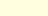
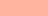
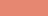

# Luna Fantasy - Documentation

1. [Introduction](#introduction)
1. [Memory](#memory)
1. [Colors](#colors)

## Introdution

Luna Fantasy is a 16 bits fantasy console, inspired by Gameboy and the NES, written in C++.

## Memory

| Start  | End    | Description                  | Notes        |
|--------|--------|------------------------------|--------------|
|`$0000` |`$FFFF` | Whole memory (64kb)          | whole memory |
|`$0000` |`$2000` | Tile memory (8kb)            | Tiles        |
|`$2000` |`$2020` | Interrupt vector (33bits)    | Interrupt    |
|`$2020` |`$221F` | Sprite table                 | Sprite table |
|`$2220` |`$241F` | Background memory (512bytes) | Background   |
|`$2420` |`$2627` | Foreground memory (512bytes) | Foreground   |
|`$2628` |`$2630` | I/O                          | I/O          |
|`$2630` |`$266F` | Global Flags/Reg (64bytes)   | Flags/Regs   |
|`$2670` |`$FFFF` | Main memory (54kb)           | Main memory  |
|`$FFFF` |`$XXXX` | Stack                        | Stack        |

1. Sprite <br>
A sprite has 2 byte for the X position, 2 bytes for the Y position,
1 byte for the tileIndex on the Tile memory, 1 byte for the animationIndex,
1 byte for the blendMode, and 9 bytes for the data, beign 14 bytes long.

A sprite could also be represented on a struct on the assembler language:
```asm
@struct Sprite {
    x: $02, y: $02,
    tileIdex: $01, animationIndex: $01,
    blendMode: $01,
    data: $09,
}
```

## Colors

It can output 8 colors plus the transparent one

| Byte   | Palette          | Color   | Hex       | Preview                                            |
|--------|------------------|---------|-----------|----------------------------------------------------|
| `0000` | Transparent      | None    | `#000000` |            |
| `0001` | Light-yellow     | White   | `#FFFFE0` |          |
| `0010` | Light-orange     | Pink    | `#FCD3C8` |          |
| `0011` | Light-red-orange | Orange  | `#FFB4A2` |  |
| `0100` | Medium-pink-red  | Red     | `#E68871` |    |
| `0101` | Cinic-silver     | Blue    | `#727C7F` |          |
| `0110` | Silver-blue      | Magenta | `#494F52` |            |
| `0111` | Onyx             | Gray    | `#353839` |                          |
| `1000` | Raisin-black     | Black   | `#242326` |          |
